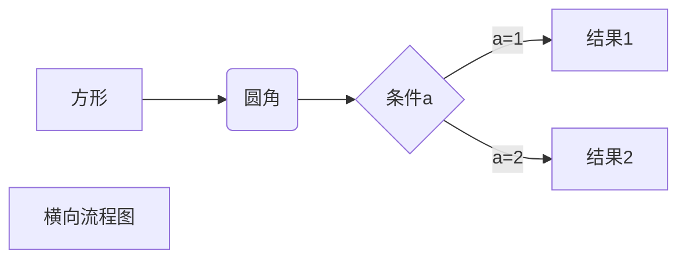

#### top——pcos

#### 3.4

##### 3.4.1

在最初的8086中不同名字的寄存器都有着特殊的用途，

在平坦寻址中对特殊寄存器的需求极大降低

一般来讲，这6个都可以看做通用寄存器；

这2个则只和栈有关。

指令：包含若干operands（源数据值，目标位置）

operand格式：

```mermaid

graph LR

A[方形] -->B(圆角)

    B --> C{条件a}

    C -->|a=1| D[结果1]

    C -->|a=2| E[结果2]

    F[横向流程图]

```

